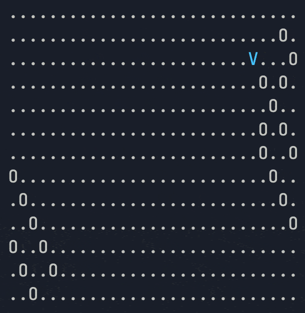

# Coin run short challenge



This is a solution with pretty logs for the Clash of Code [Coin run][1]. Hence,
credit goes to [UnicornP][2].

Before taking a look at the solution I strongly suggest you to
[try it yourself][3]!

And if you want to try it on your own computer, you can run the tests with:

```bash
./test # run all the tests with minimal output
VERBOSE=1 ./test # Verbose.
./test 1 2 # Run selected tests.
SOLUTION=./solution.py ./test # Try your solution
```

And share your solution in any language afterward!

You could also add some constraints, change output. Feel free to play with that
code.

<a href="http://www.wtfpl.net/">
	
</a>

[1]: https://www.codingame.com/contribute/view/536374d27b4ef2c99705c139e08394c5b09f
[2]: https://www.codingame.com/profile/d2306f40567a276663b3ab4ebe84a3277483093
[3]: https://www.codingame.com/ide/demo/856266bd4921997858f078395f1c641b52dc56
